# 阅读的逻辑

## 考场运营

### 做题顺序

1. 串读题干，了解文章话题，圈出可能的中心词；
2. 顺序读文章、做题，题目顺序和文章段落是一致对应的。考场之上无跳读，步步为营正确率最高。

## Tips：

1. 两个意思完全相反的选项通常有一个是正确选项
2. instead表递进，instead of表转折，不要混淆
3. 表达相反逻辑的关联词
   - 转折词：however, but, while, nonetheless, nevertheless, whereas, yet, rather than, instead of
   - 让步词：
   - 副词、介词短语：conversely, contrary to, on the contrary, by contrast, in contrast, fortunately, unfortunately
4. 否定词+比较级=最高级：It couldn’t be simpler.

## 从上下文逻辑入手判断

### 句段间逻辑

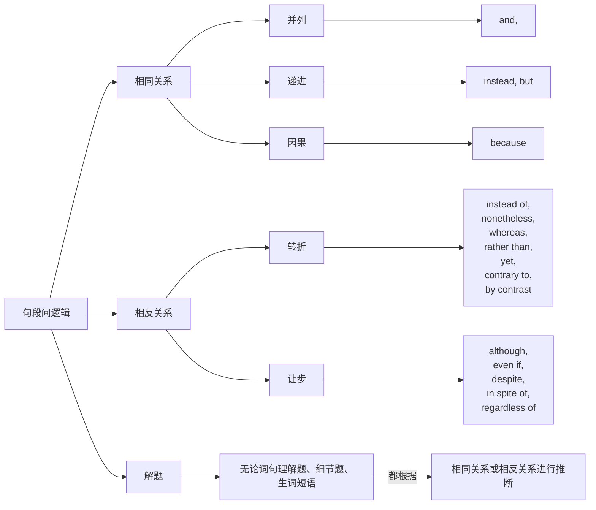

### 题干逻辑

## 把握文章中心思想、作者观点

### 首尾句串读

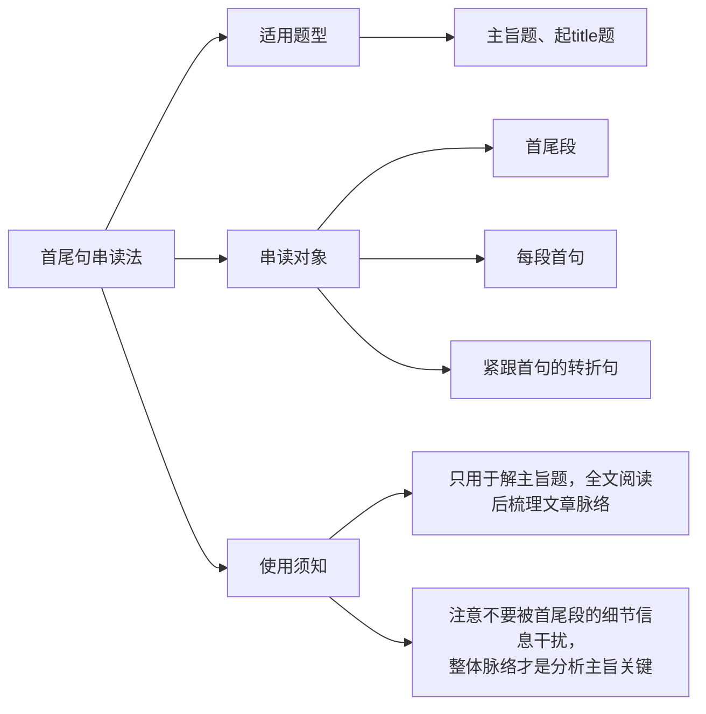

> - 如果首句只是事例，需要往后一直读到观点句。
> - 实验的过程不是重点，结论才重要，即事例本身不重要，它用于佐证什么观点才重要！
> - 如果首尾句没有给出段落中心，则自行串读全文进行总结。

### 中心词法

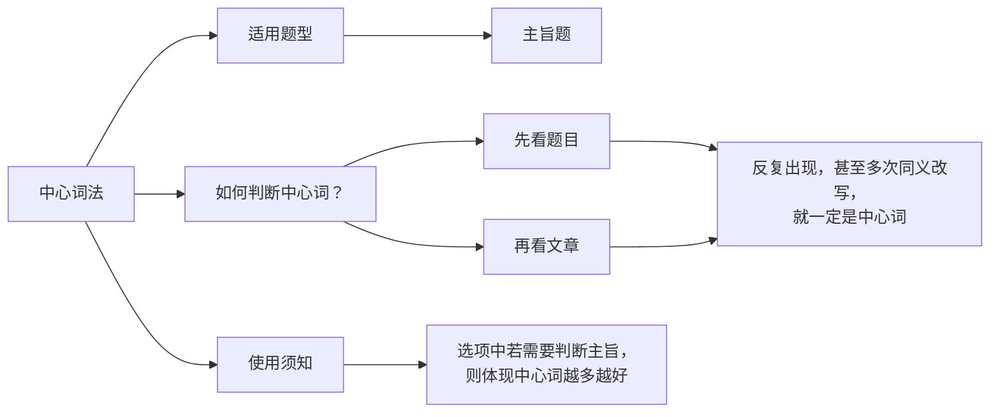

### 中心句法

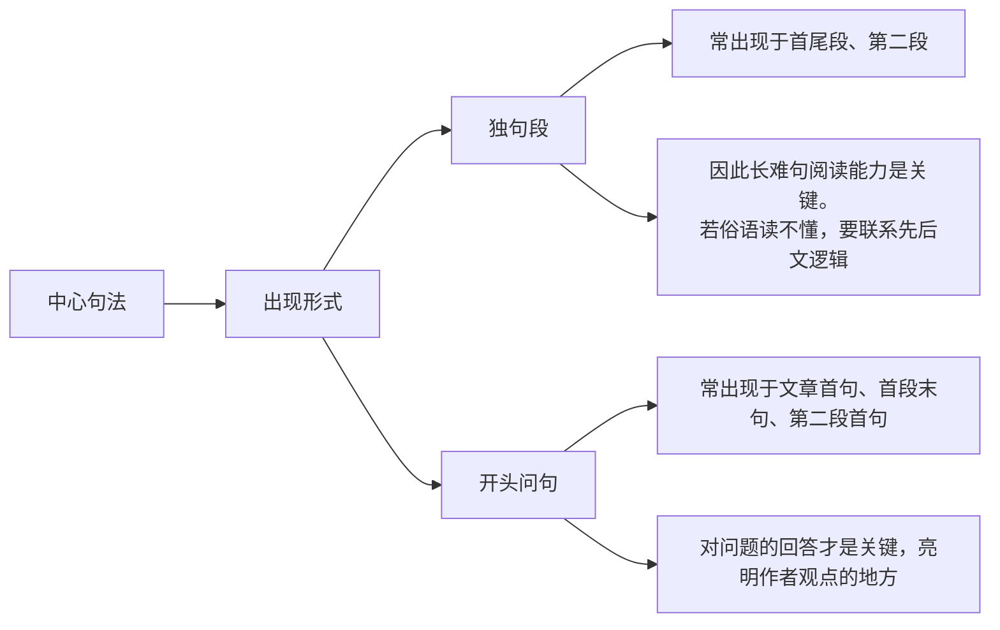

## 作者主观情感判断

1. 一篇文章的中心主旨由两部分构成：

   - 中心词

   - 作者对中心词的态度

2. 在阅读文章进行理解时，要**重感情轻意思**：

   - 要运用之前提到的上下文逻辑，推断当前语句的情感色彩，因为英文中也常常有正话反说等阴阳怪气的说法，把握好作者情感才不会被生僻的用语迷惑。

3. “小墓碑”词汇：ambiguous, indifferent, biased, tolerant, hesitant, contemptuous, uncertain, gloomy

4. 一些需要注意的熟词僻义：

   - critical: 批判的 `o`
   - passive: 负面的，消极的，被动的 `-`
   - impartial: 中立的 `o`

### 感情色彩词

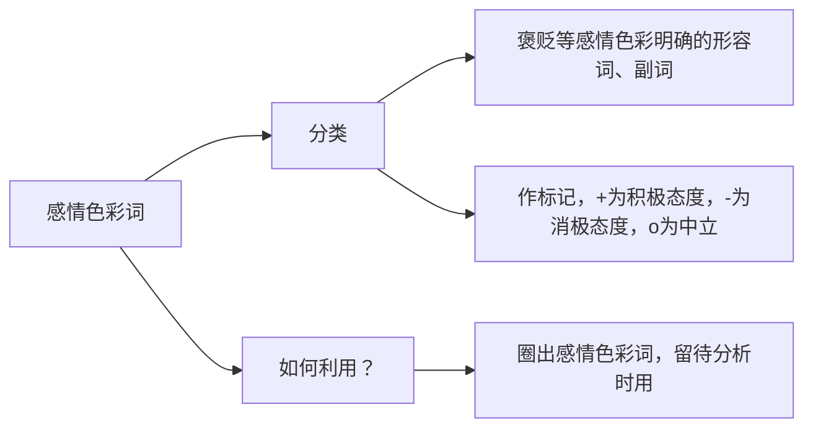

> 作者的态度一般都比较明确，不会模棱两可ambiguous，不会漠不关心indifferent，否则也没有必要写文章。
>
> 进而，作者的态度在某些现象中也可以猜测，比如不会对负面现象表示容忍tolerant，可能对科技进展表示支持、接纳、审慎等。

### 转折之处

> 作者往往在现象、大众观点之后添加转折，引出自己的观点、评论，因此首尾段转折之处需要重点关注，判断是否是作者的观点态度。
>
> 转折后的内容容易被命题人设置为推理题。

### 情态动词之后

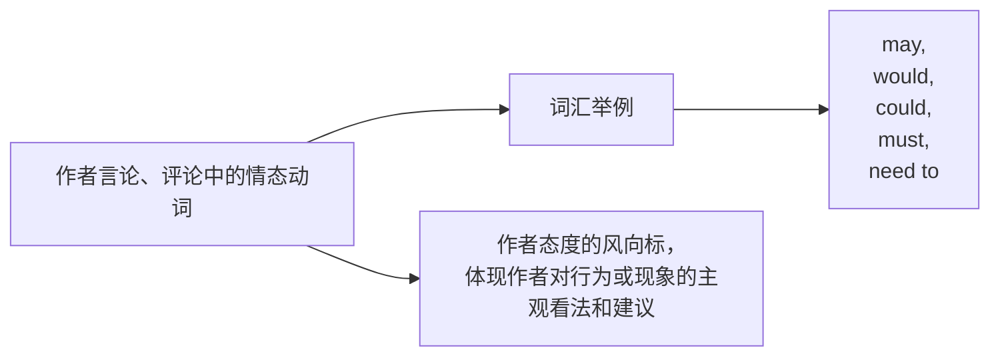

### 首尾句串读

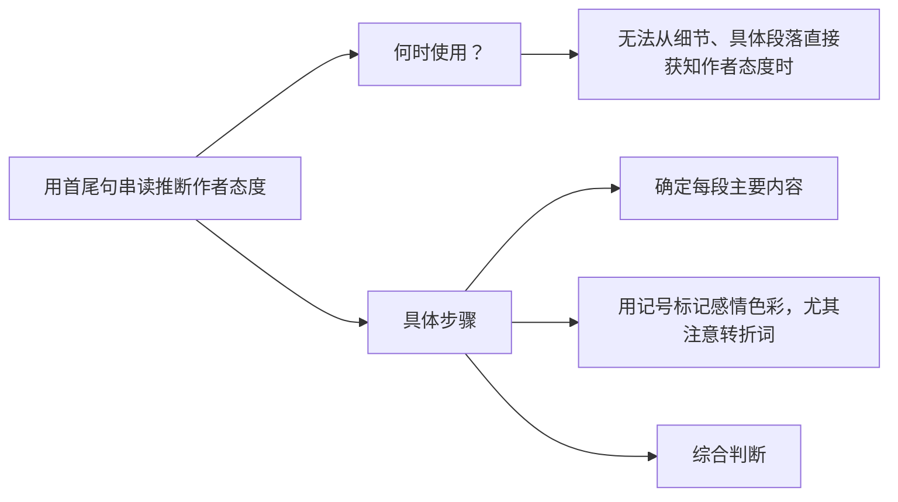

## 行文规律

### 时间对比原则

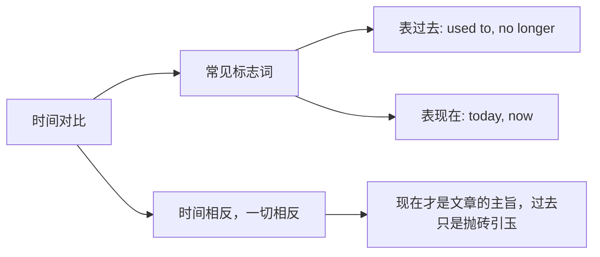

> 时间对比用于展示某一事物的前后差异和发展过程，表达“现在”更重要的观点。
>
> 题目中如果考查到全文范围，并且全文有明显的时间变化，那么选项也要体现出来，比如new, conventional, 现在完成时have been这样涉及新旧对比的明显词汇、时态表征。
>
> “Now”, “Today”在时间转移的情境下，可以当作全文（或上下文）的转折，显然转折后的才是重点。

### 少数派原则

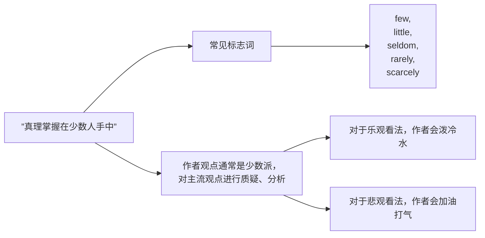

> 设置选项时，常会编一个与“少数派”观点相反、但又与常识或大众观点相适应的选项，这通常是误导选项。

### 同义改写原则

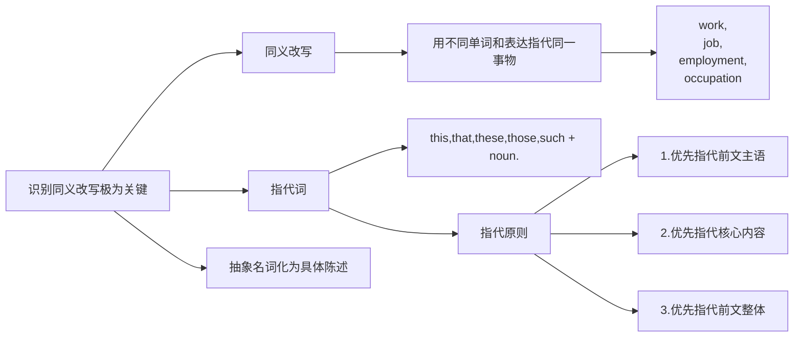

> 对于能够定位到原文位置的问题，分析透彻其中指示代词、同义改写究竟指的是什么极为重要，往往就是解题的关键。
>
> 文章不会凭空蹦出一个很生僻、怪异的概念，行文并非孤立，如果不能理解当前语段的含义究竟指代什么，尝试回溯上文找到对应的已知信息。
>
> 文章通常只讲一件事，无论作者使用什么样的论证手段，如举例、引用、正话反说、反话正说、化抽象为形象等同义改写的手段，目的都是为了佐证自己的观点。

## 分析题型

### 主旨题

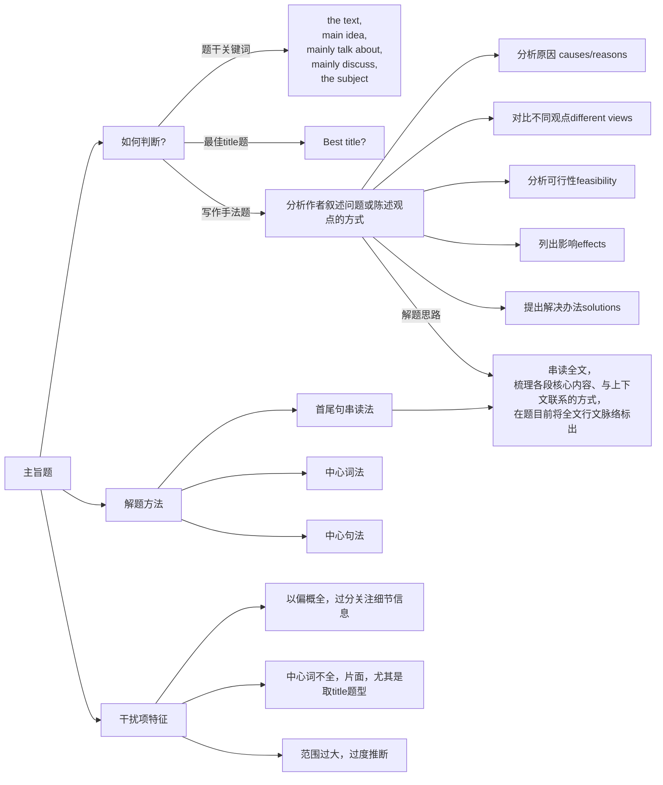

### 细节题

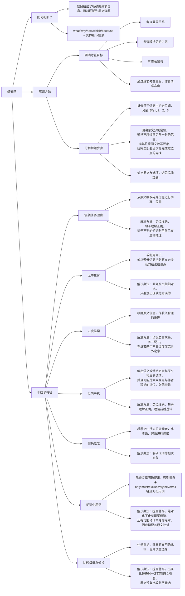

### 推理题

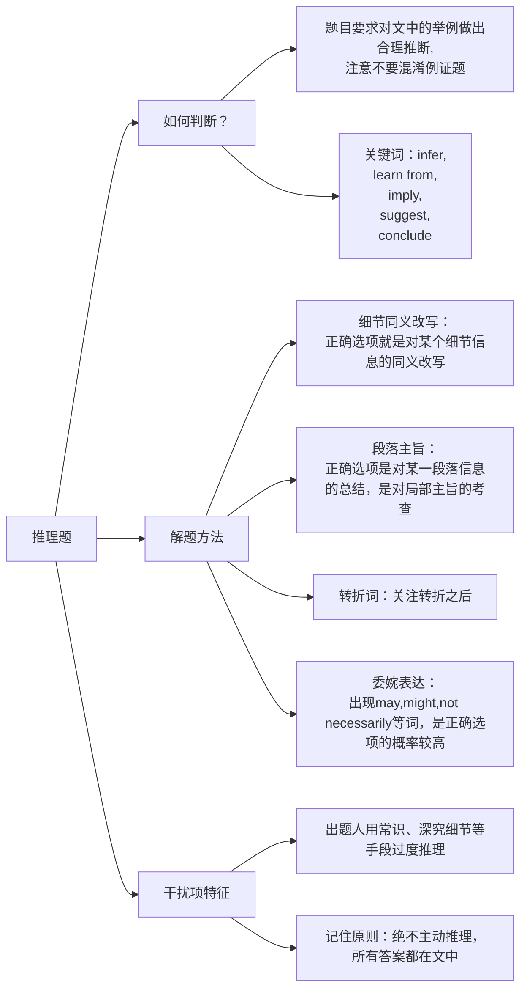

### 词汇、句子理解题

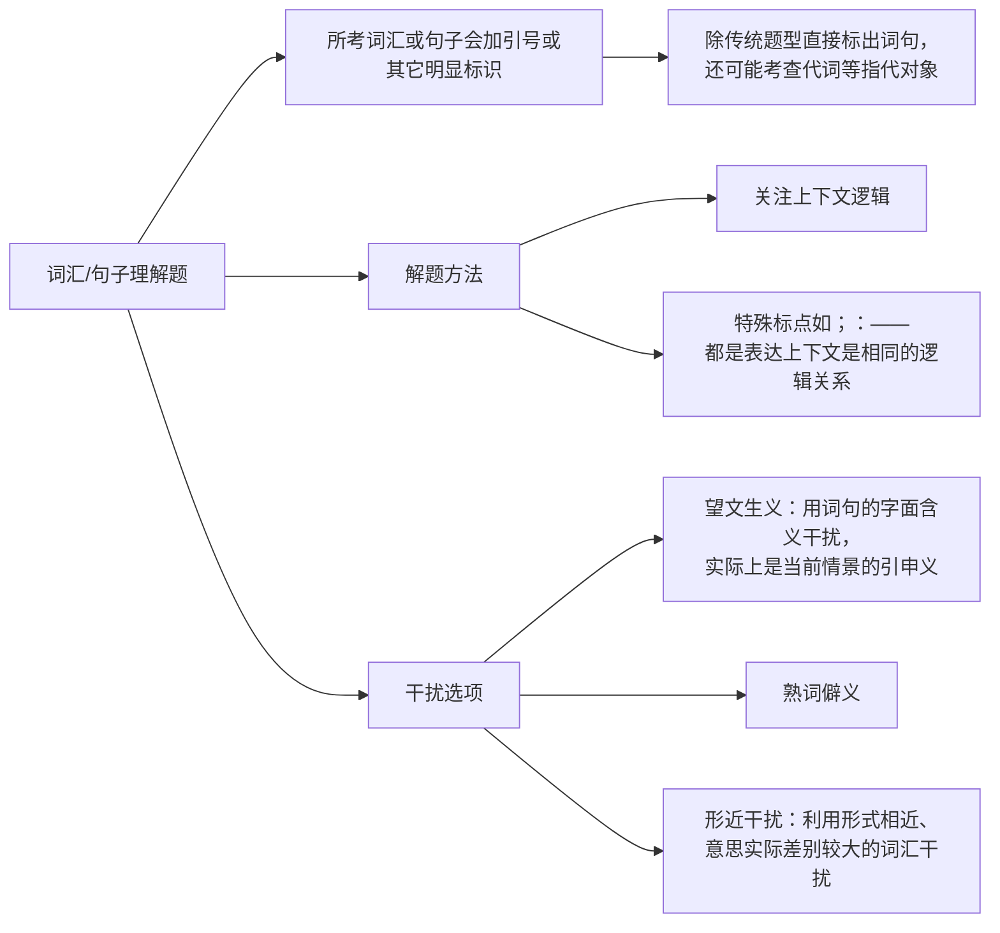

### 作者态度题

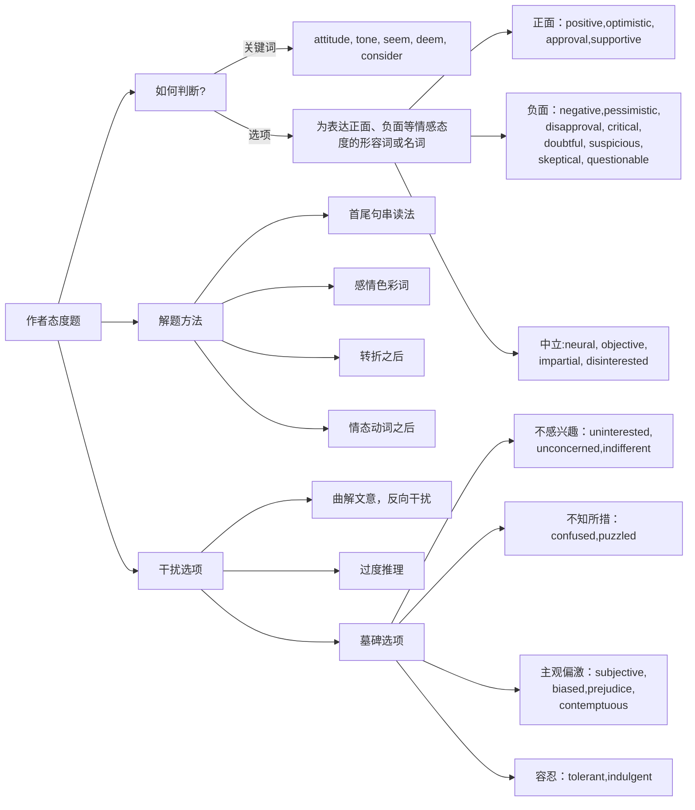

### 例证题

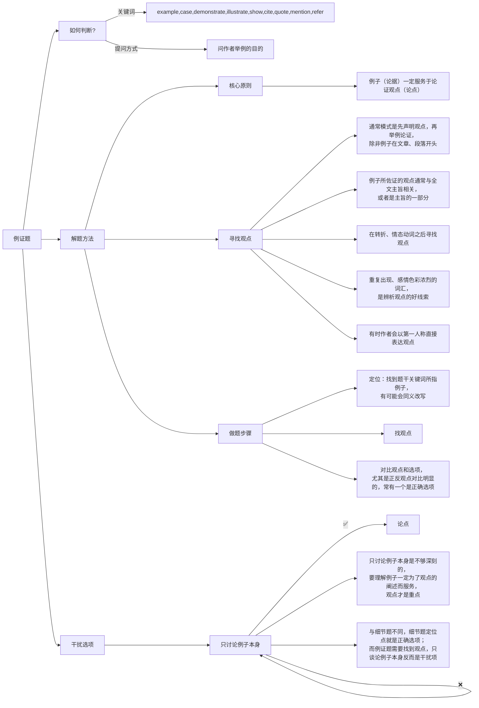

